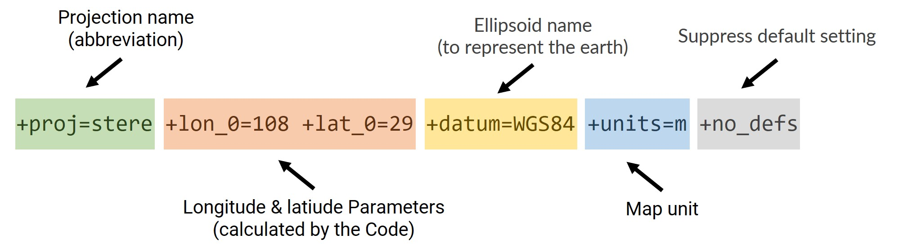

```{r, include = FALSE}
knitr::opts_chunk$set(
  collapse = TRUE,
  comment = ">#",
  fig.path = "man/figures/README-",
  out.width = "100%"
)
```

# projWiz <a href="https://stoney239.github.io/projWiz/"></a>

<!-- badges: start -->
[](https://CRAN.R-project.org/package=projWiz)
[](https://app.codecov.io/gh/sToney239/projWiz)
[](https://github.com/sToney239/projWiz/actions/workflows/R-CMD-check.yaml)
<!-- badges: end -->

`projWiz` is a package inspired by [Projection Wizard](https://projectionwizard.org/), aiming to help automatically decide map projection based on R geospatial objects.

Please note that the projection generated by this package largely depends on the extent you provide. Therefore the projection can be highly customized, and may not be suitable for large-scale projects or formal collaborations (official projections are recommended in such cases). However, for personal map-making seeking to maintain accuracy and convenience, projWiz could work.

## Installation

You can install the development version of somepackage from [GitHub](https://github.com/) with:

``` r
# install.packages("devtools")
devtools::install_github("sToney239/projWiz")
```

## Example

You can quickly obtain a proper projection for a region using the following code:

```{r example}
library(projWiz)
(new_proj = proj_equal_area(spData::alaska))
```
Messages starting with `##` indicate how the final projection is selected. The output will be a `PROJ4` or `WKT` string, which can be used with GIS packages like `sf`. You can then reproject your data as follows:

```{r}
sf::st_transform(spData::alaska, new_proj)
```

This is not an ideal example as there's an official projection for Alaska, but you can apply this method to any area of interest.

Additionally, you can modify the central longitude of the world map using the `proj_world` function. This function requires a projection shorthand name (you can find in the `world_proj_list` data within the package), and the central longitude parameter.

```{r,message=FALSE, warning=FALSE}
central_longitude = -60
selected_world_proj_type = world_proj_list$compromise$round_boudnary$Natural_Earth
new_world_proj = proj_world(selected_world_proj_type, central_longitude)

rnaturalearth::countries110 |> 
  sf::st_break_antimeridian(central_longitude) |> 
  sf::st_transform(new_world_proj) |> 
  ggplot2::ggplot() + 
  ggplot2::geom_sf() +
  ggplot2::geom_vline(xintercept = central_longitude)+
  ggplot2::theme_minimal()
```

## What this package is doing

This package is not doing complex calculation, instead just try to modify [PROJ string](https://proj.org/en/stable/index.html) or [WKT string](https://en.wikipedia.org/wiki/Well-known_text_representation_of_geometry) to specify projections. These formats allow users to customize parameters and generate user-defined projections. Because WKT strings can be lengthy and complex, I will use PROJ strings as an example.



As shown in the picture, a PROJ string consists of several parameters, each beginning with a `+`, followed by parameter specifications after the `=`. Here’s a breakdown of each part:

  - **Projection Name**: The first part specifies the shorthand name of the projection to be used. This is recommended by the code when you run functions like `proj_region()` or other regional projection functions. If you know which projection you want, you can use `proj_specify()`.
  
  - **Longitude & Latitude Parameters**: You don’t need to worry about these parameters, as the code automatically calculates the necessary values. Typically, this includes the central longitude or latitude, and may also involve parameters like "standard parallel" depending on the projection's requirements. This automation is the primary reason for creating this package, as manual calculations can be tedious.

  - **Ellipsoid and Units**: The default settings are `WGS84` for the ellipsoid and `m` for meters. You can adjust these as needed.
  
  - The last part wouldn't be changed by the functions within the package. It helps prevent unexpected issues arising from conflicts between default and user-specified settings.
