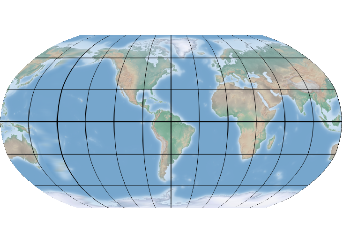

# projWiz <a href="https://stoney239.github.io/projWiz/"></a>

<!-- badges: start -->

[](https://CRAN.R-project.org/package=projWiz)
<!-- badges: end -->

The goal of projWiz is to create an R version of
[projectionwizrd](https://projectionwizard.org/), which is an
interactive web application helping select an appropriate map
projection.

Please note that the projection generated by this package largely
depends on the geo-dataset you provide. Therefore the projection can be
highly customized, and may not be suitable for large-scale projects or
formal collaborations (official projections are recommended in such
cases). However, for personal map-making seeking to maintain accuracy
and convenience, projWiz could work.

## Installation

You can install the development version of somepackage from
[GitHub](https://github.com/) with:

``` r
# install.packages("devtools")
devtools::install_github("sToney239/projWiz")
```

## Example

You can quickly obtain a proper projection for a region using the
following code:

``` r
library(projWiz)
new_proj = proj_equal_area(spData::alaska)
> ## North-south extent
> ## Select Transverse cylindrical equal area projection
new_proj
> [1] "+proj=tcea +lon_0=-179.683609 +datum=WGS84 +units=m +no_defs"
```

Messages starting with `##` indicate how the final projection is
selected. The output will be a `PROJ4` or `WKT` string, which can be
used with GIS packages like `sf`. You can then reproject your data as
follows:

``` r
sf::st_transform(spData::alaska, new_proj)
> Simple feature collection with 1 feature and 6 fields
> Geometry type: MULTIPOLYGON
> Dimension:     XY
> Bounding box:  xmin: -533012.6 ymin: 5697401 xmax: 2784099 ymax: 8226065
> Projected CRS: +proj=tcea +lon_0=-179.683609 +datum=WGS84 +units=m +no_defs
>   GEOID   NAME REGION           AREA total_pop_10 total_pop_15
> 1    02 Alaska   West 1718925 [km^2]       691189       733375
>                         geometry
> 1 MULTIPOLYGON (((31820.36 57...
```

This is not an ideal example as there’s an official projection for
Alaska, but you can apply this method to any area of interest.

Additionally, you can modify the central longitude of the world map
using the `proj_world` function. This function requires a projection
shorthand name (you can find in the `world_proj_list` data within the
package), and the central longitude parameter.

``` r
central_longitude = -60
selected_world_proj_type = world_proj_list$compromise$round_boudnary$Natural_Earth
new_world_proj = proj_world(selected_world_proj_type, central_longitude)

rnaturalearth::countries110 |> 
  sf::st_break_antimeridian(central_longitude) |> 
  sf::st_transform(new_world_proj) |> 
  ggplot2::ggplot() + 
  ggplot2::geom_sf() +
  ggplot2::geom_vline(xintercept = central_longitude)+
  ggplot2::theme_minimal()
```


