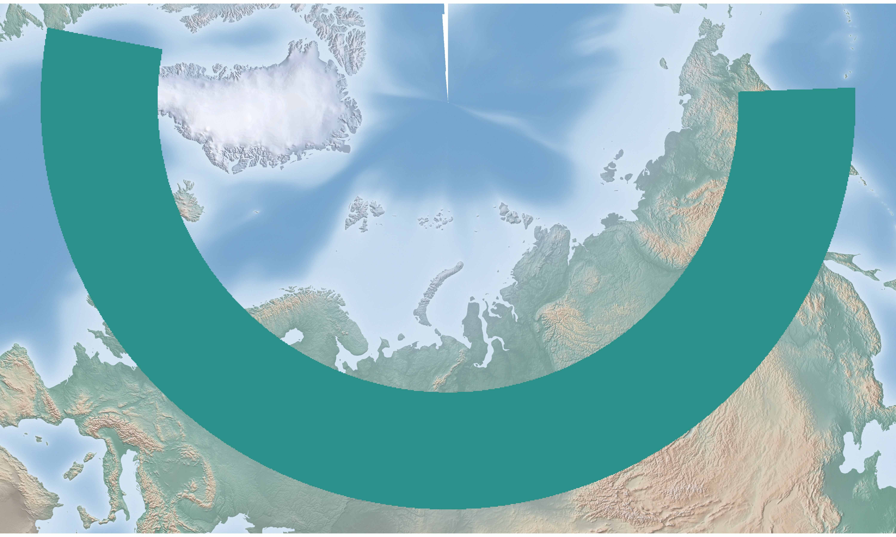
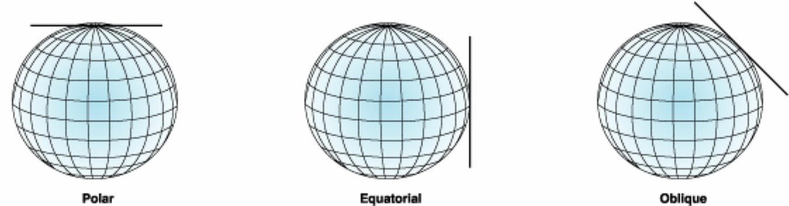
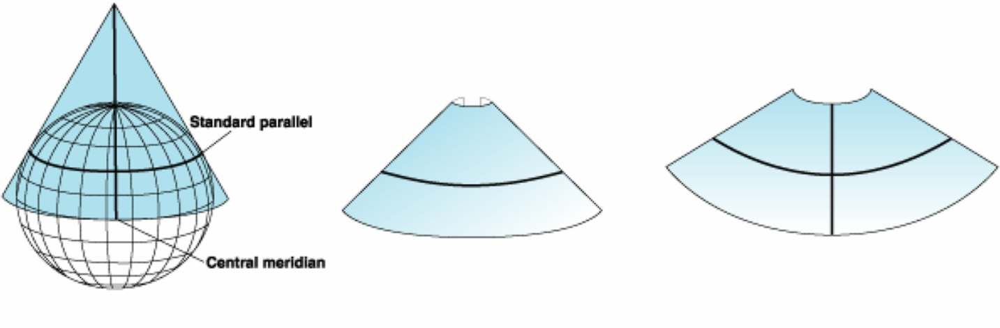
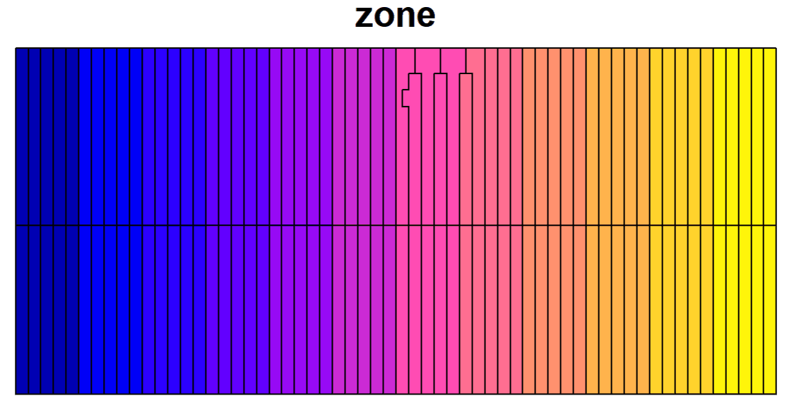

```{r, include = FALSE}
knitr::opts_chunk$set(
  collapse = TRUE,
  comment = "#>"
)
```

This article explains the procedure for selecting projections specifically for `proj_region()` and other projection functions used in regional mapping.

A rough overview has already been provided in the [Get started](https://stoney239.github.io/projWiz/articles/projWiz.html); this article offers a more detailed explanation, particularly focusing on some problems I met while exploring how to quickly specify a map projection.


## Step 0: Check for Exceeding Extent Limits

This step is called as "Step 0" because it's about whether the input boundary qualifies as "regional." If the extent exceeds half of the Earth, you will receive an error directly, and you should use functions like `proj_hemisphere()` or `proj_world()`. 

The actual extent limits for longitude and latitude are set at 160° and 80°, respectively. This choice is not based on rigid criteria but rather stems from considerations regarding certain conic projections. Since projecting over such large extents is uncommon, I set these thresholds.



> Illustration of the extreme conditions that can lead to errors when the longitude spans too widely. The green area is the area of interest (Note the flaw in the top center of the map)

> This flaw may arise from conic projection. Imagine a conic hat placed on the Earth; if the tangent line has to cover a wide area at higher latitudes, some regions near the poles may be left untouched by the hat.
If you really want to cover so wide range, please use `proj_hemisphere()` and set the map limits

## Step 1: Check for Small Map Extent

This step is to check the boundary edge lengths in longitudinal and latitudinal directions using spherical distance. If both lengths < 1000 km, the code will automatically select the corresponding azimuthal projection based on the property demand:

  - Equal Area: Lambert Azimuthal Equal Area Projection
  - Conformal: Stereographic Projection
  - Equidistant: Oblique Azimuthal Equidistant Projection


This step (selecting azimuthal projections) is because: 

  - I believe if the map extent is not too large, using an azimuthal projection with the central point as the point of tangency would be efficient and accurate. 
  - Additionally, I found someone saying that the recommended extent for Lambert Azimuthal Equal Area Projection is not over thousands of kilometers.



> Hey, how could I be wrong, if I could set the center point so flexibly, the neighborhood area must have little distortion (pic source: [ArcMap Documentation](https://desktop.arcgis.com/en/arcmap/latest/map/projections/projection-types.htm))

---

> For these azimuthal projections, the longitudinal and latitudinal parameters (please check [What this package is doing](https://stoney239.github.io/projWiz/index.html#what-this-package-is-doing)) are simply the central longitude and latitude (That's the point of tangency).

> (You don't have to consider this in the package actually, it's just let you have an idea. There will also be explanations for conic and cylindrical projections for the same purpose in the following part, if you're not interested, just skip them.)

## Step 2: Check for Map Shape


If the map's extent exceeds 1000 km, the code would move on to checking its shape.

This step involves following tutorials on setting projections:
 
  - East-west direction (width/height > 5:4): conic projection
  - North-south direction (width/height < 4:5): cylindrical projection
  - Square-shaped maps: azimuthal projection

However, these are not strict rules. For conic projections, still imagine placing a conical hat on the Earth; the cone's apex would be at the pole, and the area near the tangent line would represent the map's focus (Though this is not totally true). This means that the slant of the cone won't effectively cover regions near the equator or poles. Thus, for lower or higher latitudes, azimuthal projections may be more appropriate. Similarly for cylindrical projections, in higher latitudes azimuthal projections would be selected even if it's north-south direction.



> Help you to imagine a conical hat on the earth (pic source: [ArcMap Documentation](https://desktop.arcgis.com/en/arcmap/latest/map/projections/projection-types.htm))

---

I want to recommend two conic projections: "**Albers Equal Area**" (LAEA) and "**Lambert Conformal Conic**" (LCC). Other projections were not mentioned just because: 

  - Azimuthal projections were mentioned in Step 1, and I rarely use cylindrical projections. When I do use cylindrical projections, typically specific zones of UTM or Gauss-Kruger rather than user-specified projections would be used.
  - Equal area and conformal properties are my primary favorates; I'm not sure the utility of the equidistant property. (After all, keeping the por distance from other points to the center proportionally equal, doesn't seem cool.)
  
> About **conic projections**, specifying them usually requires two latitude parameters (apart from the longitude parameter of the central longitude), usually called as *standard parallels*. The trick is to set these parallels at [1/6 and 5/6](https://api.semanticscholar.org/CorpusID:203636100) of the latitudinal extent.

> As for **cylindrical projections**, they typically only require the central longitude as the longitudinal parameter and do not need a latitudinal parameter (If it’s not an oblique cylindrical projection, which I'm not quite familiar with😔).

> About this step, I have some concerns: if conic projections require two latitude parameters, it suggests that they attempt to find a plane that intersects the surface of the sphere. This might mean the **total distortion** would be less than that of azimuthal projections, which are based solely on a tangent point. Would it be better to prioritize conic projections for maps with a large extent? I'm unsure how sensible this thinking is, so I didn't include it in the package.

## Step 3: Other Projection Suggestions


Actually, this step was not in my plan when starting this package, but I found it relatively easy to implement (but met problems of the irregular grid of the UTM zones 😫). 

This step is about calculating the zone number for UTM or Gauss-Kruger projections. (Please note that these are all conformal projections.) It would be a good point as suggestions since these projections are often with something like [EPSG codes](https://en.wikipedia.org/wiki/EPSG_Geodetic_Parameter_Dataset) and easy to share.

For the Gauss-Kruger projection, determining the zone is as simple as dividing by 3 or 6 and applying some offsets.

But about the UTM zone, I wasn't aware that UTM has some irregular zones at first, possibly in certain European peninsulas. To address this, I added a shapefile of the UTM zones and used `sf::st_within()` to check if the input object is entirely within a UTM zone.



> Irregular grid of UTM Zone
